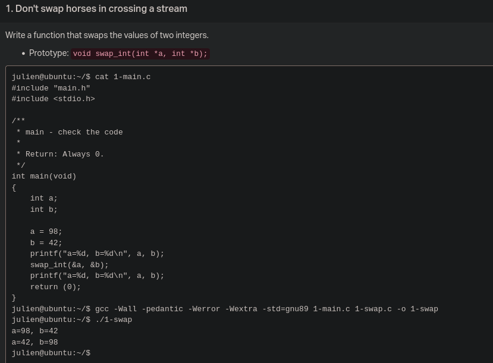
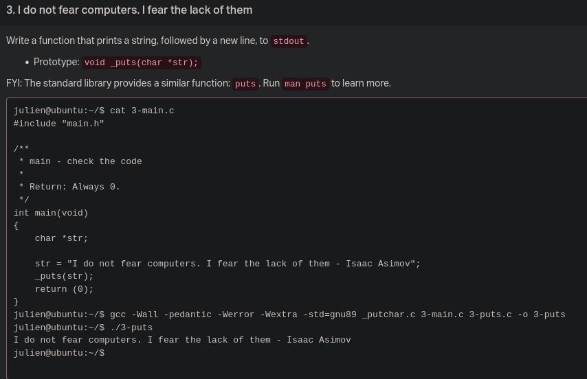
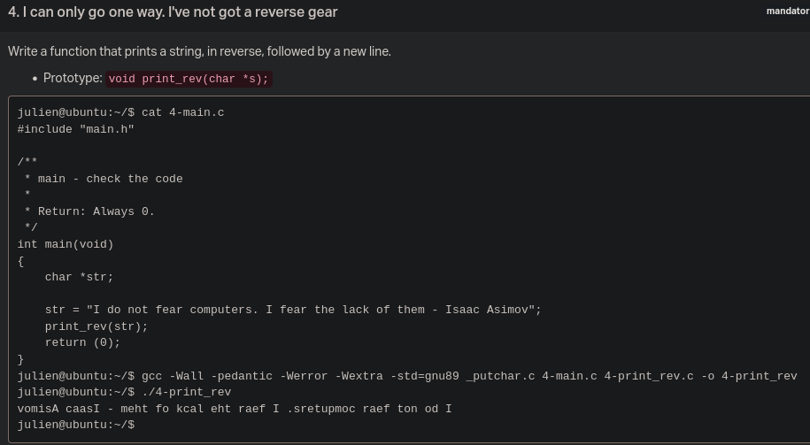
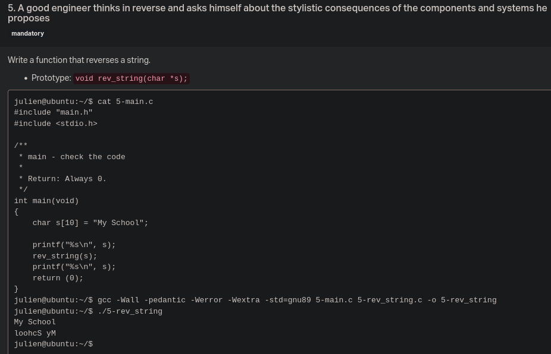
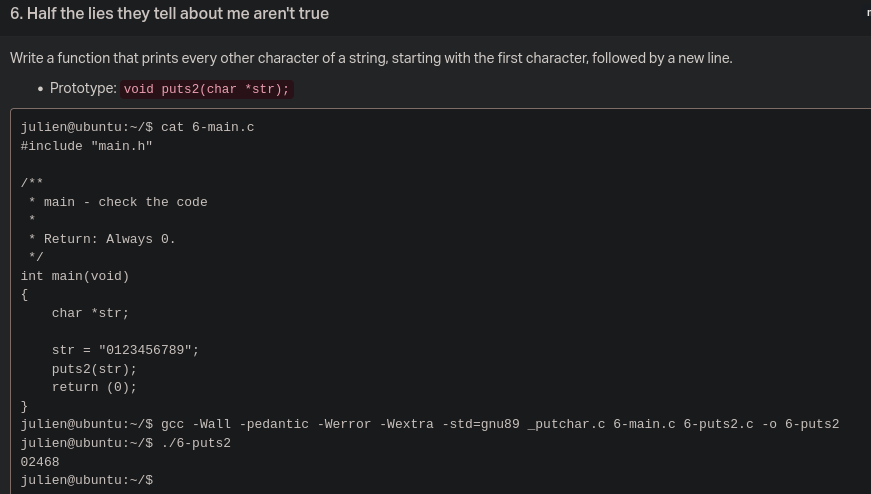
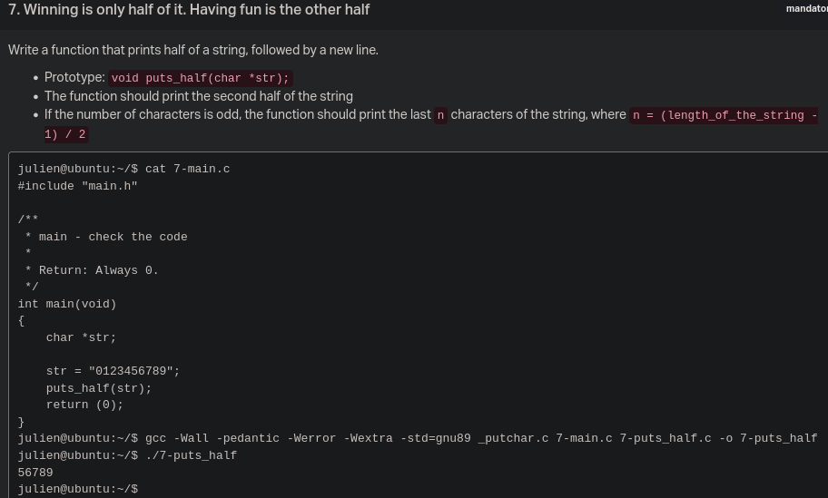
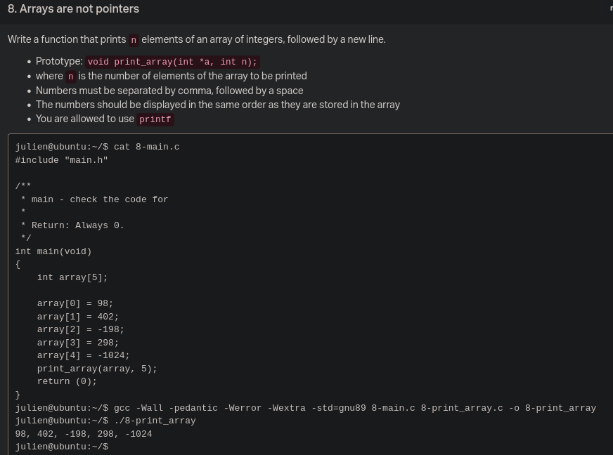
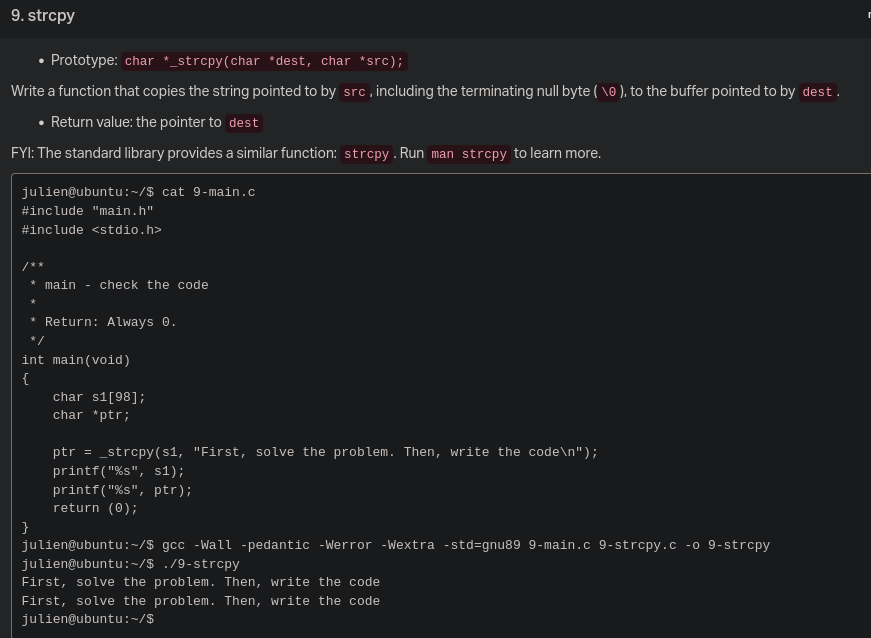
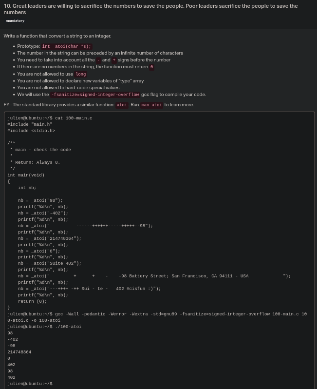

# C - Pointers, arrays and strings

## Task 00

## Task 01

## Task 02

## Task 03

## Task 04

## Task 05

## Task 06

## Task 07

## Task 08

## Task 09

## Task 10

# C - More pointers, arrays and strings

## Task 0

## Task 1

## Task 2

## Task 3

## Task 4

## Task 5

## Task 6

## Task 7

